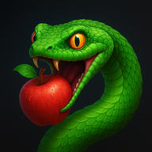

# 🐍🍎 Snake — PezzaliAPP

[](https://www.alessandropezzali.it/Snake/)
[](https://github.com/pezzaliapp/Snake.git)



Un **Snake Game** moderno, elegante e open-source.  
Sviluppato come **PWA**: funziona **offline**, è **installabile** su desktop e mobile, con controlli ottimizzati per **tastiera**, **swipe** e **pad touch**.

---

## 🎮 Funzionalità

- 🟢 **Serpente verde** in stile classico  
- 🍎 **Mela rossa** come obiettivo da mangiare  
- 🧱 Modalità **Classica** (muri = KO)  
- 🔄 Modalità **Avvolgente** (passi attraverso i bordi)  
- 📏 Griglie disponibili: **16×16**, **20×20**, **24×24**  
- ⚡ Velocità iniziale selezionabile + **accelerazione progressiva**  
- 🏆 **Record salvato** in LocalStorage  
- 📱 **Touch support**: swipe + pad su mobile  
- 💻 **Desktop support**: frecce, WASD, spazio (pausa)  
- 📦 **PWA installabile**: gioca anche offline  

---

## 📸 Anteprima

<p align="center">
  
</p>

---

## 🚀 Avvio locale

Clona la repo e apri `index.html` in un browser moderno.

```bash
git clone https://github.com/pezzaliapp/Snake.git
cd Snake

Per testare il Service Worker (offline mode), avvia un server statico:

python -m http.server

Apri http://localhost:8000.

⸻

🕹️ Comandi
	•	⬆️⬇️⬅️➡️ / WASD → Muovi il serpente
	•	␣ (spazio) → Pausa
	•	📱 Mobile → Swipe o pulsanti pad

⸻

📂 Struttura

Snake/
  index.html
  script.js
  manifest.json
  sw.js
  icons/
    icon-192.png
    icon-512.png
    favicon.png
    favicon.ico


⸻

📄 Licenza

MIT © 2025 — PezzaliAPP
Sviluppato con ❤️ per rendere open-source anche il divertimento.
